> **Relevant source files**
> * [content/about.md](https://github.com/kimdaeyoung12/TheLogos/blob/ef1c6577/content/about.md)
> * [hugo.toml](https://github.com/kimdaeyoung12/TheLogos/blob/ef1c6577/hugo.toml)
> * [layouts/_default/baseof.html](https://github.com/kimdaeyoung12/TheLogos/blob/ef1c6577/layouts/_default/baseof.html)

## Purpose and ScopeLink copied!

The Logos is a Hugo-based static site generator project implementing a dual-audience architecture that optimizes content delivery for both AI crawlers and human readers. The repository contains a complete JAMstack blog system focused on Korean/English bilingual content covering religion, philosophy, and engineering.

### Dual-Audience Design PhilosophyLink copied!

The system architecture explicitly balances two distinct consumption patterns:

| Audience | Optimization Strategy | Implementation |
| --- | --- | --- |
| **AI Crawlers** | Full-content RSS feeds, structured data, machine-readable metadata | `[services.rss] limit = -1`, JSON-LD schemas, comprehensive meta tags |
| **Human Readers** | Interactive UI, progressive enhancement, dark/light themes | Three.js graphics, CSS custom properties, localStorage persistence |

This dual-audience approach is embedded throughout the codebase, from configuration ([hugo.toml L33-L40](https://github.com/kimdaeyoung12/TheLogos/blob/ef1c6577/hugo.toml#L33-L40)

) to template design ([layouts/partials/extend_head.html L1-L50](https://github.com/kimdaeyoung12/TheLogos/blob/ef1c6577/layouts/partials/extend_head.html#L1-L50)

) to deployment strategy ([.github/workflows/hugo.yml L1-L50](https://github.com/kimdaeyoung12/TheLogos/blob/ef1c6577/.github/workflows/hugo.yml#L1-L50)

).

### Documentation StructureLink copied!

For detailed technical documentation of subsystems:

* High-level architecture and component integration: [System Architecture](#2)
* Configuration files and build pipeline: [Configuration & Build Pipeline](#3)
* Template inheritance and block structure: [Template System](#4)
* Header navigation and theme toggle (highest importance: 64.47): [Header & Navigation System](#5)
* CSS architecture and theming: [Design System & Styling](#6)
* Content creation workflows and AI automation: [Content Management](#10)

**Sources:** [hugo.toml L1-L59](https://github.com/kimdaeyoung12/TheLogos/blob/ef1c6577/hugo.toml#L1-L59)

 [content/about.md L1-L108](https://github.com/kimdaeyoung12/TheLogos/blob/ef1c6577/content/about.md#L1-L108)

 [layouts/_default/baseof.html L1-L53](https://github.com/kimdaeyoung12/TheLogos/blob/ef1c6577/layouts/_default/baseof.html#L1-L53)

---

## What is The LogosLink copied!

The Logos is a static blog website built with Hugo that explores themes at the intersection of religion, philosophy, and engineering. The site implements a dual-language content strategy (Korean and English) with a primary focus on making content accessible to both human readers and AI crawlers.

### Core PhilosophyLink copied!

The blog's philosophical framework centers on creating order from entropy, viewing life through multiple lenses:

| Perspective | Approach |
| --- | --- |
| **Scientific** | Understanding happiness through thresholds (역치), defining life through entropy |
| **Spiritual** | Reading faith through scientific language, viewing technology through faith |
| **Practical** | Building anti-fragile life structures that withstand unpredictability |

The name "The Logos" (ὁ λόγος) references John 1:1, symbolizing both the Greek philosophical concept of reason/order and the Christian concept of the Word as Christ.

### Primary TopicsLink copied!

* **Religion (종교)**: Theology, creation studies, truth vs. truth tensions
* **Philosophy (철학)**: Western philosophy, existentialism, metamodernism, everyday philosophical thinking
* **Engineering (공학)**: AI limitations, anti-fragile mechanisms, technology ethics, complex systems, chaos theory

**Sources:** [content/about.md L8-L107](https://github.com/kimdaeyoung12/TheLogos/blob/ef1c6577/content/about.md#L8-L107)

 [hugo.toml L1-L5](https://github.com/kimdaeyoung12/TheLogos/blob/ef1c6577/hugo.toml#L1-L5)

 [hugo.toml L11-L12](https://github.com/kimdaeyoung12/TheLogos/blob/ef1c6577/hugo.toml#L11-L12)

---

## System Architecture OverviewLink copied!

The Logos implements a modern JAMstack architecture where content flows from multiple sources through Hugo's static site generator to produce a fully optimized static website deployed on GitHub Pages.

### System Architecture DiagramLink copied!


**Architecture Description:**

The codebase implements five distinct architectural layers:

1. **Content Layer**: Dual input pipeline where `scripts/insta_to_post.py` fetches Instagram data via `instaloader`, sends captions to Gemini API for metadata extraction, and generates Markdown files in `content/posts/`. Manual content is written directly to `content/posts/*.md` and `content/about.md`.
2. **Configuration Layer**: `hugo.toml` defines site parameters, RSS configuration for AI crawlers (`limit: -1`, `full: true`), and related posts algorithm. `data/categories.toml` provides category metadata (name, color, icon) consumed by templates.
3. **Template Layer**: `layouts/_default/baseof.html` (importance: 15.92) defines HTML boilerplate and includes `layouts/partials/header.html` (importance: 64.47, highest-rated component). Three main layouts inherit from `baseof.html`: `layouts/index.html` (homepage), `layouts/_default/list.html` (archive with filtering), `layouts/_default/single.html` (article display).
4. **Asset Pipeline**: CSS files implement design system with `assets/css/main.css` establishing CSS custom properties, `assets/css/home.css` styling homepage grid, and `assets/css/single.css` handling article typography. JavaScript provides interactivity: `assets/js/hero-3d.js` renders Three.js constellation on homepage, `assets/js/views.js` tracks page views in localStorage.
5. **Deployment**: `.github/workflows/hugo.yml` executes on push to `main`, runs `hugo --minify`, and deploys to GitHub Pages at `thelogos.dev`.

**Sources:** [hugo.toml L1-L59](https://github.com/kimdaeyoung12/TheLogos/blob/ef1c6577/hugo.toml#L1-L59)

 [layouts/_default/baseof.html L1-L53](https://github.com/kimdaeyoung12/TheLogos/blob/ef1c6577/layouts/_default/baseof.html#L1-L53)

 [scripts/insta_to_post.py L1-L150](https://github.com/kimdaeyoung12/TheLogos/blob/ef1c6577/scripts/insta_to_post.py#L1-L150)

 [data/categories.toml L1-L20](https://github.com/kimdaeyoung12/TheLogos/blob/ef1c6577/data/categories.toml#L1-L20)

---

## Key FeaturesLink copied!

### AI-Optimized Content Delivery ArchitectureLink copied!

The repository implements explicit machine-readable optimizations throughout the stack:


**Implementation Details:**

| Configuration | Location | Technical Effect |
| --- | --- | --- |
| **Unlimited RSS Items** | `[services.rss] limit = -1` in [hugo.toml L34-L36](https://github.com/kimdaeyoung12/TheLogos/blob/ef1c6577/hugo.toml#L34-L36) | Disables RSS feed pagination, exposing complete content archive in single feed |
| **Full Content RSS** | `[params.rss] full = true` in [hugo.toml L38-L40](https://github.com/kimdaeyoung12/TheLogos/blob/ef1c6577/hugo.toml#L38-L40) | Includes entire article HTML in `<description>` tags instead of summaries |
| **Raw HTML Support** | `[markup.goldmark.renderer] unsafe = true` in [hugo.toml L7-L9](https://github.com/kimdaeyoung12/TheLogos/blob/ef1c6577/hugo.toml#L7-L9) | Allows inline HTML in Markdown for AI-generated summary boxes with custom styling |
| **Structured Data** | JSON-LD schema in [layouts/_default/single.html L100-L150](https://github.com/kimdaeyoung12/TheLogos/blob/ef1c6577/layouts/_default/single.html#L100-L150) | Emits `BlogPosting` and `BreadcrumbList` schemas for search engine comprehension |
| **Rich Metadata** | Open Graph and Twitter Cards in [layouts/partials/extend_head.html L1-L50](https://github.com/kimdaeyoung12/TheLogos/blob/ef1c6577/layouts/partials/extend_head.html#L1-L50) | Provides social graph metadata, image URLs, and article metadata for AI content indexers |

This multi-layer approach ensures AI crawlers can efficiently consume content via RSS while search engines receive structured data for proper indexing.

**Sources:** [hugo.toml L7-L9](https://github.com/kimdaeyoung12/TheLogos/blob/ef1c6577/hugo.toml#L7-L9)

 [hugo.toml L33-L40](https://github.com/kimdaeyoung12/TheLogos/blob/ef1c6577/hugo.toml#L33-L40)

 [layouts/partials/extend_head.html L1-L50](https://github.com/kimdaeyoung12/TheLogos/blob/ef1c6577/layouts/partials/extend_head.html#L1-L50)

 [layouts/_default/single.html L1-L200](https://github.com/kimdaeyoung12/TheLogos/blob/ef1c6577/layouts/_default/single.html#L1-L200)

### Dual Content Creation WorkflowLink copied!

The system supports two distinct content authoring methods:

**Manual Authoring:**

* Authors write Markdown files directly in `content/posts/`
* Front matter includes `title`, `date`, `categories`, `tags`, `description`, `draft` status
* Uses Hugo's archetype system (`archetypes/default.md`) for consistent structure

**Automated Instagram Import:**

* `insta_to_post.py` script fetches Instagram posts via Instaloader
* Sends captions to Google Gemini API for intelligent metadata extraction
* Generates Hugo-formatted Markdown with Instagram embeds
* Automatically populates: title, summary, tags, mentions, category

**Sources:** [content/about.md L57-L59](https://github.com/kimdaeyoung12/TheLogos/blob/ef1c6577/content/about.md#L57-L59)

### Theme SystemLink copied!

The site implements a sophisticated light/dark theme toggle:

* **Storage**: User preference persisted in `localStorage` as `pref-theme`
* **Fallback**: Detects OS preference via `prefers-color-scheme` media query
* **Implementation**: CSS custom properties in `:root` mapped to `.dark` class
* **Scope**: Site-wide theme switching controlled through `layouts/partials/header.html`

### Related Content DiscoveryLink copied!

Hugo's related content engine finds similar posts based on weighted criteria:

```
[related]  includeNewer = true  threshold = 80  toLower = true  [[related.indices]]    name = "categories"    weight = 100    [[related.indices]]    name = "tags"    weight = 80    [[related.indices]]    name = "date"    weight = 10
```

Categories have the highest weight (100), followed by tags (80), with date providing minor influence (10).

**Sources:** [hugo.toml L42-L59](https://github.com/kimdaeyoung12/TheLogos/blob/ef1c6577/hugo.toml#L42-L59)

---

## Technology Stack and File StructureLink copied!

### Technology Stack and DependenciesLink copied!


**Core Dependencies:**

* **Hugo Extended 0.148.2**: Required for SCSS processing and advanced image manipulation. Extended version provides libsass and WebP support.
* **PaperMod Theme**: Installed as Git submodule in `themes/PaperMod/`, provides base template structure heavily customized in `layouts/` directory.
* **Instaloader**: Python library for Instagram data extraction without OAuth, used by `scripts/insta_to_post.py` to fetch post captions and metadata.
* **Gemini 2.0 Flash API**: Google's generative AI model accessed via `google-generativeai` Python package, generates titles, summaries, and tags from Instagram captions.
* **Three.js**: JavaScript 3D library loaded via CDN in `layouts/index.html`, renders animated constellation effect in hero section via `assets/js/hero-3d.js`.
* **Pretendard Font**: Modern Korean sans-serif font loaded from JSDelivr CDN in [layouts/_default/baseof.html L33-L34](https://github.com/kimdaeyoung12/TheLogos/blob/ef1c6577/layouts/_default/baseof.html#L33-L34)  used for UI elements and headings.
* **Noto Serif KR**: Google Fonts serif typeface loaded in [layouts/_default/baseof.html L36-L38](https://github.com/kimdaeyoung12/TheLogos/blob/ef1c6577/layouts/_default/baseof.html#L36-L38)  used for article body text to enhance readability.

**Sources:** [layouts/_default/baseof.html L33-L40](https://github.com/kimdaeyoung12/TheLogos/blob/ef1c6577/layouts/_default/baseof.html#L33-L40)

 [scripts/insta_to_post.py L1-L20](https://github.com/kimdaeyoung12/TheLogos/blob/ef1c6577/scripts/insta_to_post.py#L1-L20)

 [.github/workflows/hugo.yml L1-L50](https://github.com/kimdaeyoung12/TheLogos/blob/ef1c6577/.github/workflows/hugo.yml#L1-L50)

 [layouts/index.html L1-L100](https://github.com/kimdaeyoung12/TheLogos/blob/ef1c6577/layouts/index.html#L1-L100)

### Directory StructureLink copied!

```go
TheLogos/
├── .github/
│   └── workflows/
│       └── hugo.yml                 # CI/CD deployment pipeline
├── archetypes/
│   └── default.md                   # Content template for new posts
├── assets/
│   ├── css/
│   │   ├── main.css                 # Core design system (16.30)
│   │   ├── single.css               # Article-specific styles (14.62)
│   │   ├── custom.css               # Component overrides
│   │   └── home.css                 # Homepage styles
│   └── js/
│       ├── views.js                 # Local view tracking
│       └── single.js                # Article interactions
├── content/
│   ├── _index.md                    # Homepage content (12.93)
│   ├── about.md                     # About page (11.28)
│   └── posts/                       # Blog posts directory
│       └── *.md                     # Individual post files
├── data/
│   └── categories.toml              # Category metadata (5.53)
├── layouts/
│   ├── _default/
│   │   ├── baseof.html              # Root template (16.46)
│   │   ├── list.html                # Post listing (34.55)
│   │   └── single.html              # Article template (24.61)
│   ├── index.html                   # Homepage template (23.82)
│   └── partials/
│       ├── header.html              # Navigation & theme (66.92)
│       ├── extend_head.html         # SEO metadata (5.06)
│       └── extend_footer.html       # Footer extensions
├── static/                          # Static assets
├── hugo.toml                        # Hugo configuration (11.00)
├── insta_to_post.py                 # Instagram automation (12.12)
└── .env                             # API keys (gitignored)
```

The numbers in parentheses represent relative importance scores based on change frequency and interconnection density.

**Sources:** [hugo.toml L1-L6](https://github.com/kimdaeyoung12/TheLogos/blob/ef1c6577/hugo.toml#L1-L6)

---

## Content Types and OrganizationLink copied!

### Content HierarchyLink copied!

The site organizes content into three primary types:

| Content Type | File Location | Purpose | Template |
| --- | --- | --- | --- |
| **Homepage** | `content/_index.md` | Welcome message and site description | `layouts/index.html` |
| **About Page** | `content/about.md` | Site philosophy and author information | `layouts/_default/single.html` |
| **Blog Posts** | `content/posts/*.md` | Main content articles | `layouts/_default/single.html` |
| **Post Listings** | Auto-generated | Category/tag archive pages | `layouts/_default/list.html` |

### Taxonomy SystemLink copied!

Content is classified using Hugo's taxonomy system:

**Categories** (defined in `data/categories.toml`):

* Religion (종교): Color `#4285F4`, Icon `✝️`
* Philosophy (철학): Color `#EA4335`, Icon `🤔`
* Engineering (공학): Color `#34A853`, Icon `⚙️`

**Tags**: Free-form keywords for granular content classification

The taxonomy configuration in `hugo.toml` enables automatic category and tag pages:

```
[taxonomies]  category = "categories"  tag = "tags"
```

**Sources:** [hugo.toml L29-L31](https://github.com/kimdaeyoung12/TheLogos/blob/ef1c6577/hugo.toml#L29-L31)

 [content/_index.md L1-L7](https://github.com/kimdaeyoung12/TheLogos/blob/ef1c6577/content/_index.md#L1-L7)

 [content/about.md L34-L50](https://github.com/kimdaeyoung12/TheLogos/blob/ef1c6577/content/about.md#L34-L50)

---

## Build and Deployment PipelineLink copied!

### CI/CD WorkflowLink copied!


### Build ConfigurationLink copied!

The GitHub Actions workflow (`.github/workflows/hugo.yml`) executes on:

* Push to `main` branch
* Manual workflow dispatch

**Build environment:**

* Hugo version: `0.148.2` (extended edition required for SCSS processing)
* Build command: `hugo --minify` (generates minified HTML/CSS/JS in `public/`)
* Permissions: `contents: read`, `pages: write`, `id-token: write`

**Deployment target:**

* Platform: GitHub Pages
* URL: `https://thelogos.dev`
* Environment: `github-pages`

The pipeline ensures every commit to `main` automatically updates the live site within minutes.

**Sources:** [hugo.toml L1](https://github.com/kimdaeyoung12/TheLogos/blob/ef1c6577/hugo.toml#L1-L1)

---

## Navigation Structure and Menu SystemLink copied!

The site navigation implements a Hugo menu system with dynamic rendering and responsive behavior:

```mermaid
flowchart TD

hugo_toml_menu["hugo.toml [menu] section"]
menu_home["홈 (weight: 1)"]
menu_posts["Posts (weight: 2)"]
menu_about["About (weight: 3)"]
header_html["layouts/partials/header.html"]
site_menus["site.Menus.main iteration"]
active_detection[".IsMenuCurrent / .HasMenuCurrent"]
responsive["Responsive behavior mobile vs desktop"]
theme_toggle["Theme toggle button localStorage persistence"]
dropdown["Dropdown submenus click-based"]
keyboard_nav["Keyboard navigation accessibility"]

subgraph features ["Navigation Features"]
    responsive
    theme_toggle
    dropdown
    keyboard_nav
end

subgraph template ["Header Template Rendering"]
    header_html
    site_menus
    active_detection
end

subgraph config ["Menu Configuration"]
    hugo_toml_menu
    menu_home
    menu_posts
    menu_about
end
```



**Menu Configuration Structure:**

Menu items are defined in [hugo.toml L14-L28](https://github.com/kimdaeyoung12/TheLogos/blob/ef1c6577/hugo.toml#L14-L28)

 with weight-based ordering:

```
[menu]  [[menu.main]]    name = "홈"        # Korean "Home"    url = "/"    weight = 1       # First position  [[menu.main]]    name = "Posts"    url = "/posts/"    weight = 2       # Second position  [[menu.main]]    name = "About"    url = "/about/"    weight = 3       # Third position
```

**Header Implementation:**

The `layouts/partials/header.html` (importance: 64.47) template iterates through `site.Menus.main` and implements:

* **Active State Detection**: Uses `.IsMenuCurrent` and `.HasMenuCurrent` to highlight current page/section
* **Responsive Behavior**: Click-based mobile menu vs hover-based desktop navigation
* **Theme Toggle**: Switches between light/dark modes with localStorage persistence via `pref-theme` key
* **Dropdown Support**: Nested menu items expand on click for mobile, hover for desktop
* **Keyboard Navigation**: Arrow keys and Enter/Escape for accessibility compliance

**Sources:** [hugo.toml L14-L28](https://github.com/kimdaeyoung12/TheLogos/blob/ef1c6577/hugo.toml#L14-L28)

 [layouts/partials/header.html L1-L100](https://github.com/kimdaeyoung12/TheLogos/blob/ef1c6577/layouts/partials/header.html#L1-L100)

---

## SummaryLink copied!

The Logos is a technically sophisticated static blog that balances AI accessibility with human-friendly design. Its architecture emphasizes:

1. **Dual Content Pipelines**: Manual authoring and automated Instagram import with AI metadata generation
2. **AI-First Design**: Full-content RSS feeds, structured data, comprehensive metadata
3. **Template Modularity**: Hugo's block-based inheritance for maintainable templates
4. **Theme Flexibility**: CSS custom properties enabling seamless light/dark mode switching
5. **Automated Deployment**: Zero-touch CI/CD from commit to production

The codebase demonstrates a modern static site approach where content is king, progressive enhancement guides JavaScript usage, and automation reduces manual overhead.

**Sources:** [hugo.toml L1-L59](https://github.com/kimdaeyoung12/TheLogos/blob/ef1c6577/hugo.toml#L1-L59)

 [content/about.md L1-L108](https://github.com/kimdaeyoung12/TheLogos/blob/ef1c6577/content/about.md#L1-L108)

 [content/_index.md L1-L7](https://github.com/kimdaeyoung12/TheLogos/blob/ef1c6577/content/_index.md#L1-L7)

Refresh this wiki

Last indexed: 9 January 2026 ([ef1c65](https://github.com/kimdaeyoung12/TheLogos/commit/ef1c6577))

### On this page

* [Overview](#1-overview)
* [Purpose and Scope](#1-purpose-and-scope)
* [Dual-Audience Design Philosophy](#1-dual-audience-design-philosophy)
* [Documentation Structure](#1-documentation-structure)
* [What is The Logos](#1-what-is-the-logos)
* [Core Philosophy](#1-core-philosophy)
* [Primary Topics](#1-primary-topics)
* [System Architecture Overview](#1-system-architecture-overview)
* [System Architecture Diagram](#1-system-architecture-diagram)
* [Key Features](#1-key-features)
* [AI-Optimized Content Delivery Architecture](#1-ai-optimized-content-delivery-architecture)
* [Dual Content Creation Workflow](#1-dual-content-creation-workflow)
* [Theme System](#1-theme-system)
* [Related Content Discovery](#1-related-content-discovery)
* [Technology Stack and File Structure](#1-technology-stack-and-file-structure)
* [Technology Stack and Dependencies](#1-technology-stack-and-dependencies)
* [Directory Structure](#1-directory-structure)
* [Content Types and Organization](#1-content-types-and-organization)
* [Content Hierarchy](#1-content-hierarchy)
* [Taxonomy System](#1-taxonomy-system)
* [Build and Deployment Pipeline](#1-build-and-deployment-pipeline)
* [CI/CD Workflow](#1-cicd-workflow)
* [Build Configuration](#1-build-configuration)
* [Navigation Structure and Menu System](#1-navigation-structure-and-menu-system)
* [Summary](#1-summary)

Ask Devin about TheLogos
